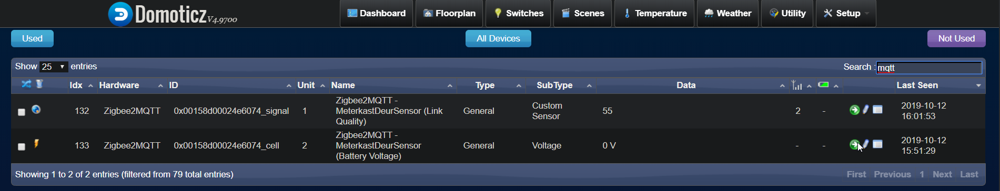
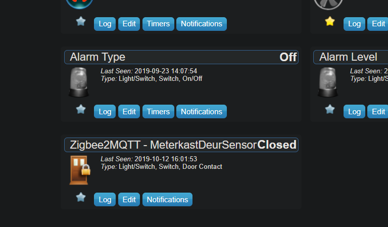

# Zigbee devices toevoegen

## Zigbee devicce toevoegen via Xiaomi hub

Het toevoegen van een Zigbee device aan Domocicz via de Xiaomi hub werkt als volgt:

* Allereerst dient de Xiaomi hub aan Domoticz te zijn gekoppeld. Zie hiervoor [deze instructie](hardware-setup.md).
* Open de Xiaomi app op je telefoon en klik het plusje rechtsbovenin de app om het apparaat op te zoeken.
* Kies voor manueel toevoegen (Add manually)[1](images/Screenshot_20191213-101716_Mi-Home.jpg) en selecteer het apparaat wat je wilt toevoegen.
* Volg de instructies op het scherm om het device te koppelen (5 seconden knopje indrukken, lichtje moet 3x branden etc.)[2](images/Screenshot_20191213-101726_Mi-Home.jpg).
* Pak het device in kwestie dat je wilt toevoegen en voer de instructie uit.
* Na enkele momenten krijg je van de Hub een bevestiging dat het apparaat is gekoppeld. Geeft het een [naam en locatie](images/Screenshot_20191213-101822_Mi-Home.jpg).
* Je bent nu klaar in de app, ga nu naar "Domoticz > Setup > Devices > Not Used" om de sensor te koppelen.
* In het overzicht zie je onder Xiaomi Gatteway Keuken dat er een onbekend device is bijgekomen. In dit [geval een deursensor](images/xiaomi-door-sensor-add1.png).
* Klik op het groene pijltje rechts om de deursensor toe te voegen. Geef deze een betekenisvolle naam en klik op de "Add device" knop
* Daarna de sensor toevoegen of aanpassen naar wens, zoals het type van 'sensor' naar 'door sensor' aanpassen bijvoorbeeld.


## Zigbee devices toevoegen aan Zigbee2MQTT

De onderstaande instructie gebruik ik om een nieuwe Zigbee device toe te voegen aan mijn Zigbee2MQTT netwerk in Domoticz.

Configuratie waarbij devices joinen direct na het connecteren met MQTT gestopt wordt, ondanks dat pairen toegestaan is...

```
homeassistant: false
mqtt:
  base_topic: zigbee2mqtt
  server: 'mqtt://127.0.0.1'
permit_join: 'true'
serial:
  port: /dev/ttyACM1
```

De bijbehorende logfiles zien er als volgt uit:
```
bas@bespin:/opt/zigbee2mqtt $ sudo npm start

> zigbee2mqtt@1.6.0 start /opt/zigbee2mqtt
> node index.js

  zigbee2mqtt:info 10/12/2019, 3:39:45 PM Logging to directory: '/opt/zigbee2mqtt/data/log/2019-10-12.15-39-43'
  zigbee2mqtt:info 10/12/2019, 3:39:45 PM Starting zigbee2mqtt version 1.6.0 (commit #e26ad2a)
  zigbee2mqtt:info 10/12/2019, 3:39:45 PM Starting zigbee-shepherd
  zigbee2mqtt:info 10/12/2019, 3:39:47 PM zigbee-shepherd started
  zigbee2mqtt:info 10/12/2019, 3:39:47 PM Coordinator firmware version: '20190608'
  zigbee2mqtt:info 10/12/2019, 3:39:47 PM Currently 0 devices are joined:
  zigbee2mqtt:warn 10/12/2019, 3:39:47 PM `permit_join` set to  `true` in configuration.yaml.
  zigbee2mqtt:warn 10/12/2019, 3:39:47 PM Allowing new devices to join.
  zigbee2mqtt:warn 10/12/2019, 3:39:47 PM Set `permit_join` to `false` once you joined all devices.
  zigbee2mqtt:info 10/12/2019, 3:39:47 PM Zigbee: allowing new devices to join.
  zigbee2mqtt:info 10/12/2019, 3:39:47 PM Connecting to MQTT server at mqtt://127.0.0.1
  zigbee2mqtt:info 10/12/2019, 3:39:47 PM zigbee-shepherd ready
  zigbee2mqtt:info 10/12/2019, 3:39:47 PM Connected to MQTT server
  zigbee2mqtt:info 10/12/2019, 3:39:47 PM MQTT publish: topic 'zigbee2mqtt/bridge/state', payload 'online'
  zigbee2mqtt:info 10/12/2019, 3:39:47 PM MQTT publish: topic 'zigbee2mqtt/bridge/log', payload '{"type":"devices","message":[{"ieeeAddr":"0x00124b00194a04ad","type":"Coordinator"}]}'
  zigbee2mqtt:info 10/12/2019, 3:39:47 PM Zigbee: disabling joining new devices.
  zigbee2mqtt:info 10/12/2019, 3:39:47 PM MQTT publish: topic 'zigbee2mqtt/bridge/config', payload '{"version":"1.6.0","commit":"e26ad2a","coordinator":20190608,"log_level":"info","permit_join":false}'
  zigbee2mqtt:info 10/12/2019, 3:39:48 PM MQTT publish: topic 'zigbee2mqtt/bridge/config', payload '{"version":"1.6.0","commit":"e26ad2a","coordinator":20190608,"log_level":"info","permit_join":false}'
^C  zigbee2mqtt:info 10/12/2019, 3:41:35 PM MQTT publish: topic 'zigbee2mqtt/bridge/state', payload 'offline'
  zigbee2mqtt:info 10/12/2019, 3:41:35 PM Disconnecting from MQTT server
  zigbee2mqtt:info 10/12/2019, 3:41:35 PM zigbee-shepherd stopped
```

## Nieuw device koppelen
Om een nieuw device te koppelen dient er een ietwat technische handmatige handeling verricht te worden.

Wanneer Zigbee2mqtt via als service is gestart, dan deze uitschakelen met:
```
sudo systemctl stop zigbee2mqtt
```

Vervolgens voer je de volgende handelingen uit:
```
cd /opt/zigbee2mqtt/
sudo cp data/configuration.yaml{,.backcurrentdate}

sudo nano data/configuration.yaml

# Pas de configuratie aan door het serveradres te veranderen naar een niet bestaande server. Bv. 172.0.0.1

homeassistant: false
mqtt:
  base_topic: zigbee2mqtt
  server: 'mqtt://172.0.0.1'
permit_join: 'true'
serial:
  port: /dev/ttyACM1

# Bewaar het bestand en start in de console zigbee2mqtt

sudo npm start
```

In de logging zul je zien dat er geen verbinding met de mqtt service gemaakt kan worden. Gek genoeg blijft wel de configuratie optie om devices te pairen aan staan.

Druk nu op de pairing knop van het device dat je in Domoticz wilt opnemen. Je ziet nu een soortgelijke logging over het scherm gaan:
```
  zigbee2mqtt:info 10/12/2019, 3:45:48 PM Logging to directory: '/opt/zigbee2mqtt/data/log/2019-10-12.15-45-46'
  zigbee2mqtt:info 10/12/2019, 3:45:48 PM Starting zigbee2mqtt version 1.6.0 (commit #e26ad2a)
  zigbee2mqtt:info 10/12/2019, 3:45:48 PM Starting zigbee-shepherd
  zigbee2mqtt:info 10/12/2019, 3:45:50 PM zigbee-shepherd started
  zigbee2mqtt:info 10/12/2019, 3:45:50 PM Coordinator firmware version: '20190608'
  zigbee2mqtt:info 10/12/2019, 3:45:50 PM Currently 0 devices are joined:
  zigbee2mqtt:warn 10/12/2019, 3:45:50 PM `permit_join` set to  `true` in configuration.yaml.
  zigbee2mqtt:warn 10/12/2019, 3:45:50 PM Allowing new devices to join.
  zigbee2mqtt:warn 10/12/2019, 3:45:50 PM Set `permit_join` to `false` once you joined all devices.
  zigbee2mqtt:info 10/12/2019, 3:45:50 PM Zigbee: allowing new devices to join.
  zigbee2mqtt:info 10/12/2019, 3:45:50 PM Connecting to MQTT server at mqtt://172.0.0.1
  zigbee2mqtt:info 10/12/2019, 3:45:50 PM zigbee-shepherd ready
  zigbee2mqtt:error 10/12/2019, 3:46:20 PM Not connected to MQTT server!
  zigbee2mqtt:error 10/12/2019, 3:46:30 PM Not connected to MQTT server!
  zigbee2mqtt:info 10/12/2019, 3:48:18 PM New device 'lumi.sensor_magnet.aq2' with address 0x00158d00024e6074 connected!
  zigbee2mqtt:error 10/12/2019, 3:48:18 PM Not connected to MQTT server!
  zigbee2mqtt:error 10/12/2019, 3:48:18 PM Cannot send message: topic: 'zigbee2mqtt/bridge/log', payload: '{"type":"device_connected","message":"0x00158d00024e6074","meta":{"modelID":"lumi.sensor_magnet.aq2"}}
  zigbee2mqtt:error 10/12/2019, 3:48:20 PM Not connected to MQTT server!
  zigbee2mqtt:info 10/12/2019, 3:48:30 PM Successfully reenabled joining
  zigbee2mqtt:error 10/12/2019, 3:48:30 PM Not connected to MQTT server!
  zigbee2mqtt:info 10/12/2019, 3:48:38 PM Device incoming...
  zigbee2mqtt:error 10/12/2019, 3:48:38 PM Not connected to MQTT server!
  zigbee2mqtt:error 10/12/2019, 3:48:38 PM Cannot send message: topic: 'zigbee2mqtt/bridge/log', payload: '{"type":"pairing","message":"device incoming"}
  zigbee2mqtt:error 10/12/2019, 3:48:40 PM Not connected to MQTT server!
  zigbee2mqtt:error 10/12/2019, 3:48:50 PM Not connected to MQTT server!
  zigbee2mqtt:error 10/12/2019, 3:50:43 PM Cannot send message: topic: 'zigbee2mqtt/bridge/state', payload: 'offline
  zigbee2mqtt:info 10/12/2019, 3:50:43 PM zigbee-shepherd stopped
```

Je ziet nu dat "PM New device 'lumi.sensor_magnet.aq2' with address 0x00158d00024e6074 connected!" is opgenomen in de configuratie.

```
homeassistant: false
mqtt:
  base_topic: zigbee2mqtt
  server: 'mqtt://127.0.0.1'
permit_join: 'true'
serial:
  port: /dev/ttyACM1
#advanced:
#  log_level: debug
devices:
  '0x00158d00024e6074':
    friendly_name: '0x00158d00024e6074'
    retain: false
```

Verander de friendly name naar iets wat herkenbaar is, zoals "MeterkastDeurSensor". Het is belangrijk dat dit een betekenisvolle naam is zodat je het device later herkend in Domoticz.

Wanneer je alle gewenste devices hebt opgenomen in de configuratie, kun je pairen moedwillig uitzetten om haching tegen te gaan met de configuratie optie: ``permit_join: 'false'``

Wanneer de service later weer gestart wordt, dan is de device herkenbaar en zal deze in de logging te zien zijn.

```
bas@bespin:/opt/zigbee2mqtt $ sudo npm start

> zigbee2mqtt@1.6.0 start /opt/zigbee2mqtt
> node index.js

  zigbee2mqtt:info 10/12/2019, 3:57:44 PM Logging to directory: '/opt/zigbee2mqtt/data/log/2019-10-12.15-57-42'
  zigbee2mqtt:info 10/12/2019, 3:57:44 PM Starting zigbee2mqtt version 1.6.0 (commit #e26ad2a)
  zigbee2mqtt:info 10/12/2019, 3:57:44 PM Starting zigbee-shepherd
  zigbee2mqtt:info 10/12/2019, 3:57:46 PM zigbee-shepherd started
  zigbee2mqtt:info 10/12/2019, 3:57:46 PM Coordinator firmware version: '20190608'
  zigbee2mqtt:info 10/12/2019, 3:57:46 PM Currently 1 devices are joined:
  zigbee2mqtt:info 10/12/2019, 3:57:46 PM MeterkastDeurSensor (0x00158d00024e6074): MCCGQ11LM - Xiaomi Aqara door & window contact sensor (EndDevice)
  zigbee2mqtt:warn 10/12/2019, 3:57:46 PM `permit_join` set to  `true` in configuration.yaml.
  zigbee2mqtt:warn 10/12/2019, 3:57:46 PM Allowing new devices to join.
  zigbee2mqtt:warn 10/12/2019, 3:57:46 PM Set `permit_join` to `false` once you joined all devices.
  zigbee2mqtt:info 10/12/2019, 3:57:46 PM Zigbee: allowing new devices to join.
  zigbee2mqtt:info 10/12/2019, 3:57:46 PM Connecting to MQTT server at mqtt://127.0.0.1
  zigbee2mqtt:info 10/12/2019, 3:57:46 PM zigbee-shepherd ready
  zigbee2mqtt:info 10/12/2019, 3:57:46 PM Connected to MQTT server
  zigbee2mqtt:info 10/12/2019, 3:57:46 PM MQTT publish: topic 'zigbee2mqtt/bridge/state', payload 'online'
  zigbee2mqtt:info 10/12/2019, 3:57:46 PM MQTT publish: topic 'zigbee2mqtt/MeterkastDeurSensor', payload '{"contact":false,"linkquality":70}'
  zigbee2mqtt:info 10/12/2019, 3:57:47 PM MQTT publish: topic 'zigbee2mqtt/bridge/log', payload '{"type":"devices","message":[{"ieeeAddr":"0x00124b00194a04ad","type":"Coordinator"},{"ieeeAddr":"0x00158d00024e6074","type":"EndDevice","model":"MCCGQ11LM","friendly_name":"MeterkastDeurSensor","nwkAddr":28730,"manufId":4151,"manufName":"LUMI","powerSource":"Battery","modelId":"lumi.sensor_magnet.aq2","hwVersion":2,"swBuildId":"3000-0001","dateCode":"20161128"}]}'
  zigbee2mqtt:info 10/12/2019, 3:57:47 PM Zigbee: disabling joining new devices.
  zigbee2mqtt:info 10/12/2019, 3:57:47 PM MQTT publish: topic 'zigbee2mqtt/bridge/config', payload '{"version":"1.6.0","commit":"e26ad2a","coordinator":20190608,"log_level":"info","permit_join":false}'
  zigbee2mqtt:info 10/12/2019, 3:57:47 PM MQTT publish: topic 'zigbee2mqtt/bridge/config', payload '{"version":"1.6.0","commit":"e26ad2a","coordinator":20190608,"log_level":"info","permit_join":false}'
  zigbee2mqtt:info 10/12/2019, 4:01:52 PM MQTT publish: topic 'zigbee2mqtt/MeterkastDeurSensor', payload '{"contact":true,"linkquality":55}'
^[[A^[[A^[[B^[[B^[[B^[[B^C  zigbee2mqtt:info 10/12/2019, 4:04:50 PM MQTT publish: topic 'zigbee2mqtt/bridge/state', payload 'offline'
  zigbee2mqtt:info 10/12/2019, 4:04:50 PM Disconnecting from MQTT server
  zigbee2mqtt:info 10/12/2019, 4:04:50 PM zigbee-shepherd stopped
```

## Opnemen van de device in Domoticz
De onderstaande procedure kun je volgen in Domoticz om het gepairde device op te nemen:

* Ga in Domoticz naar het menu: Setup > Devices.
* Klik op de knop "Not used" rechts bovenin.
* Gebruik het filter met "mqtt"
* Selecteer het gewenste device wat je wilt opnemen en klik het groene bolletje aan de rechterkant.
* Geef daarna het device een betekenisvolle naam zodat je deze later herkend.
* in het juiste menu kun je daarna de sensor terugvinden.





## Sensoren die tot nu toe geconfigureerd zijn:
```
homeassistant: false
mqtt:
  base_topic: zigbee2mqtt
  server: 'mqtt://127.0.0.1'
permit_join: true
serial:
  port: /dev/ttyACM1
devices:
  '0x00158d00024e6074':
    friendly_name: MeterkastDeurSensor
    retain: false
  '0x00158d00024e2fad':
    friendly_name: SchuifpuiDeurSensor
    retain: false
  '0x00158d0002537090':
    friendly_name: GarageDeurSensor
    retain: false
  '0x00158d000273c3c5':
    friendly_name: WoonkamerTemperatuurSensor
    retain: false
  '0x00158d00024e60aa':
    friendly_name: VoorDeurSensor
    retain: false
  '0x00158d0002536f1a':
    friendly_name: 'KeukenRaamSensor'
    retain: false
```

## Troubleshooting Zigbee2mqtt
When devices are not responding or no signals are received, it is possible that the hardware has to be reset.

To determine this, stop the zigbee2mtt service for Domoticz and start npm in debugging mode

```
cd /opt/zigbee2mqtt
sudo systemctl stop zigbee2mqtt
sudo npm start
```

It is possible that the output will be like this:

```
zigbee2mqtt:info 10/17/2019, 7:47:54 PM Starting zigbee-shepherd
  zigbee2mqtt:error 10/17/2019, 7:48:12 PM Error while starting zigbee-shepherd! (Error: SRSP - SYS - osalNvRead after 6000ms)
  zigbee2mqtt:error 10/17/2019, 7:48:12 PM Press the reset button on the stick (the one closest to the USB) and start again
  zigbee2mqtt:error 10/17/2019, 7:48:12 PM Failed to start
	{"message":"SRSP - SYS - osalNvRead after 6000ms","stack":"Error: SRSP - SYS - osalNvRead after 6000ms\n    at Timeout.object.timer.setTimeout [as _onTimeout] (/opt/zigbee2mqtt/node_modules/zigbee-herdsman/dist/znp/znp.js:227:24)\n    at ontimeout (timers.js:436:11)\n    at tryOnTimeout (timers.js:300:5)\n    at listOnTimeout (timers.js:263:5)\n    at Timer.processTimers (timers.js:223:10)"}
  zigbee2mqtt:error 10/17/2019, 7:48:12 PM Exiting...
npm ERR! code ELIFECYCLE
npm ERR! errno 1
npm ERR! zigbee2mqtt@1.6.0 start: `node index.js`
npm ERR! Exit status 1
npm ERR! 
npm ERR! Failed at the zigbee2mqtt@1.6.0 start script.
npm ERR! This is probably not a problem with npm. There is likely additional logging output above.

npm ERR! A complete log of this run can be found in:
npm ERR!     /root/.npm/_logs/2019-10-17T17_48_48_113Z-debug.log
```

To solve this, take the zigbee usb stick out of the pi and stick it back in.

Then check with npm if everything is working fine. If yes, then restart the mqtt service for domoticz again.

```
sudo systemctl stop zigbee2mqtt
```