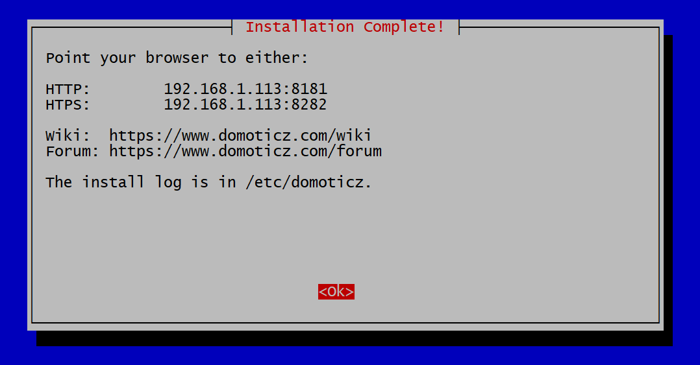

Installation instructions are on this page: https://www.domoticz.com/wiki/Raspberry_Pi

Install with:

```
sudo curl -L https://install.domoticz.com | bash
```

Installatie opties:

* http & https (bij alleen http wordt toch https geconfigureerd...)
* Portnumbers: http: 8181, https: 8282
* Installatiefolder: /opt/domoticz
* Install log staat in /etc/domoticz



Na installatie, de firewall aanpassen:

```
sudo ufw allow 8181/tcp
```

Als dit gereed is, dan kun je Domoticz benaderen via: 

http://192.168.1.113:8181/#/Dashboard

Volg verder de Domoticz Wiki op: https://www.domoticz.com/wiki/Getting_started

## Domoticz opstarten met system startup

Afkomstig van: https://www.domoticz.com/wiki/Linux#Starting_Domoticz_automatically_when_the_system_boots

Standaard start Domoticz niet op als je het systeem herstart. Dit is op te lossen door een Deamon van Domoticz te maken op de volgende Systemd manier:

Open the systemd configuration file, here you can change the port number you wish to use. To use a port below 1024 you can run as root (not reccomended) or you can un-comment one of the marked lines in the file - you should only un-comment one of the lines depending on your Ubuntu version :

```
vi /etc/systemd/system/domoticz.service
```

Copy the following config:

```
[Unit]
       Description=domoticz_service
[Service]
       User=root
       Group=root
       ExecStart=/opt/domoticz/domoticz -www 8181 -sslwww 8282
       WorkingDirectory=/opt/domoticz
       #
       # Give the right to open priviliged ports. This allows you to run on a port <1024 without root permissions (user/group setting $
       #
       # The following line is for pre-16.04 systems.
       # ExecStartPre=setcap 'cap_net_bind_service=+ep' /home/domoticz/domoticz/domoticz
       #
       # The below works on Ubuntu 16.04 LTS
       # CapabilityBoundingSet=CAP_NET_BIND_SERVICE
       #
       # The following works on Ubuntu 18.04
       # AmbientCapabilities=CAP_NET_BIND_SERVICE
       #
       Restart=on-failure
       RestartSec=1m
       #StandardOutput=null
[Install]
       WantedBy=multi-user.target
```

Enable the service

```
systemctl daemon-reload
systemctl enable domoticz.service
```

Start the service

```
systemctl start domoticz.service
status domoticz.service
```