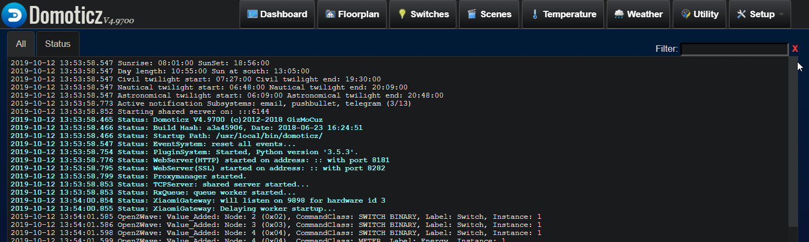

# Hardware setup in Domoticz
This manual describes the installation and setup for hardware in Domoticz on the Raspberry Pi.

## Setting up the Xiaomi gateway with the Mi Home app.
1. Install the Xiaomi 'Mi Home' app on your phone (iPhone or Android).  
2. Open the Xiaomi app.  
3. Click the + (add device - Upper right).  
4. Select devices nearby, your hub should be recocnized automatically.  
5. Select the hub in your list of devices.  
6. Open the configuration center (three dots upper right).  
7. Click 'About'.  
8. In the screen below, you will see the version number. Tap it three times to enable two extra menu items in the screen.  
9. Click on 'Wireless communication protocol'.  
10. Enable the switch 'Wireless communication protocol'. A password will appear.  
11. Write down the password. You will need it when setting up the hun in Domoticz. 
12.  Go to the menu 'Hub Info'. Try to find the IP address in the text you see and write it down. You are finished with the hub at this moment.  

## Setting up the Xiaomi hub in Domoticz
1. Open Domoticz and go to 'Settings > Hardware'.  
2. Enter a name for your hub in the 'Name field'. E.g. "Xiaomi Hub".  
3. In the Type menu select 'Xiaomi Gateway'.  
4.  After Data timeout select 'Disabled'.  
5. Enter the remote IP address of your Xiaomi hub in the Remote Address field.  
6. Enter the following portnumber in the Port Number field: 9898
7. Enter the Xiaomi Password you wrote down earlier in the Password field.  
8. Click the 'Add' button to add the device to Domoticz.  

Final tip. When the gateway works, try NOT to update the app or the device firmware. Its possible that some options or menu items will be moved or removed :-|

## Adding Zigbee devices to Domotics.
See [Adding Zigbee devices to Domoticz](add-zigbee-device.md)

## Adding the 'Aeotec ZW090 Z-Stick Gen5 EU' OpenZwave USB stick to Domoticz
1. Put the OpenZwave USB stick in one of the Raspberry Pi USB ports.  
2. Open Domoticz and go to 'Setup > Hardware'.  
3. Enter a name in the name field. E.g. OpenZwave USB.  
4. Select type 'OpenZWave USB' in the Type pulldown menu.  
5. Select 'Disabled' in the data timeout pulldown menu.  
6. Select the correct USB port where the USB stick resides (/dev/ttyACM0).  
7. Click the 'Add' button. The USB device will appear in the hardware list.

## Setup of the Zwave stick
See [screenshot](./images/2019-09-19-19_52_56-Zoetermeer.png).  
This section is for adding a security key, stop color blinking, device polling and debugging.
1. Go to the hardware section in Domoticz.
2. To set up the Zwave controller, click the small blue 'setup' button that shows in the 'Type' cell.
3. Select the row 'Aeotec ZW090 Z-Stick Gen5 EU'. A menu appears below.
4. Change the desired setting of the stick (e.g. no blinking).  
5. Click the button 'Apply configuration for this device'.  

## Adding Zwave devices to Domotics.
See [Adding Zwave devices to Domoticz](add-zwave-device.md)

## Adding the 'RFXCOM - RFXtrx433 USB 433.92MHz' Klik aan, klik uit transceiver
1. Put the RFXCom usb cable in one of the USB ports of the Raspi. 
Open a terminmal window on the Pi and type 'dmesg'. You should see a line similar to "```FIDI serial device converter now attached to <ttyport>```". Remember this port.
2. IN domoticz go to 'Setup > Hardware'.  
3. Enter a name for the device in the 'Name' field.  
4. Select the type 'RFXCOM - RFXtrx433 USB 433.92MHz transciever' in the type pulldown menu.  
5. Select 'Disabled' in the Data timeout menu.  
6. Select the USB port the device is plugged in (/dev/ttyUSB0).  
7.  Click the 'Add' button to add the device.

If everything goes well, the device should be detected and added to the hardware list.
To upgrade the firmware, check the [RFXCom website](http://www.rfxcom.com/epages/78165469.sf/nl_NL/?ObjectPath=/Shops/78165469/Categories/Downloads) first

## Setup of the RFXCom transciever
See [screenshot](./images/2019-09-19-20_03_33-Zoetermeer.png).
1.  in the row of the transciever, a small 'Set mode' button should be available.  
2. Deselect everything except the following (most popular) modes: Oregon scientific, AC, ARC, X10.
3. Click the 'Set mode' button.

## Adding Kaku devices to Domotics.
See [Adding Kaku devices to Domoticz](add-kaku-device.md)

## Adding a zigbee protocol transciever
### Preparing the CC 2531 transciever
These instructions are copied from the [Zigbee2MQTT page](https://www.zigbee2mqtt.io/getting_started/flashing_the_cc2531.html).

1. Buy a [CC2531 USB]() stick on Ali Express and a [CC Debugger kit]() to be able to update the formware on the USB stick.
2. Install [SmartRF Flash programmer](https://www.ti.com/tool/FLASH-PROGRAMMER#) (NOT V2). This software is free but requires a Texas Instruments account in order to download. It is also [local available](./binaries/flash-programmer-1.12.8.zip).
3. Install the [CC debugger driver](http://www.ti.com/general/docs/lit/getliterature.tsp?baseLiteratureNumber=swrc212&fileType=zip) on your PC (Windows only). [Local available](./binaries/swrc212a.zip). Before continuing, verify that the CC Debugger driver has been installed correctly. See Figure 1. [Verify Correct Driver Installation @ Chapter 5.1.](http://www.ti.com/lit/ug/swru197h/swru197h.pdf)([or local(./ebooks/swru197h.pdf)]) In case the CC Debugger is not recognized correctly [install the driver manually](https://www.youtube.com/watch?v=jyKrxxXOvQY).  In my case I opened 'Apparaatbeheer'. The CC Debugger was not shown as a recognized device, as well as the CC2531. I updated the CC Debugger driver manually with the downloaded files. After that I reconnected the device and it was succesfully recognized (As well as the CC 2531 transciever).
4. Connect ``CC debugger --> Downloader cable CC2531 --> CC2531 USB sniffer``.
5. Connect BOTH the CC2531 USB sniffer and the CC debugger to your PC using USB.
6. If the light on the CC debugger is RED press set reset button on the CC debugger. The light on the CC debugger should now turn GREEN. If not use CC debugger user guide to troubleshoot your problem.    

  

### Flashing the MC2531

1. Download the firmware [CC2531_DEFAULT_20190608.zip](https://github.com/Koenkk/Z-Stack-firmware/raw/master/coordinator/Z-Stack_Home_1.2/bin/default/CC2531_DEFAULT_20190608.zip)([Local file](./binaries/CC2531_DEFAULT_20190608.zip))
2. Start SmartRF Flash Programmer, setup as shown below and press Perform actions. Make sure to select the .hex file, NOT the .bin file! 


Sluit nu de USB sniffer aan op een vrije poort van de Raspberry Pi!

### Running Zigbee2mqtt
Van [zigbee2mqtt.io](https://www.zigbee2mqtt.io/getting_started/running_zigbee2mqtt.html) en [Domoticz Zigbee2MQTT](https://www.domoticz.com/wiki/Zigbee2MQTT).

#### Determine location of CC2531 USB sniffer and checking user permissions

We first need to determine the location of the CC2531 USB sniffer. Connect the CC2531 USB to your Raspberry Pi. Most of the times the location of the CC2531 is /dev/ttyACM0. This can be verified by:
```
pi@raspberry:~ $ ls -l /dev/ttyACM1
crw-rw---- 1 root dialout 166, 0 May 16 19:15 /dev/ttyACM0  # <-- CC2531 on /dev/ttyACM0
```

As an alternative, the device can also be mapped by an ID. This can be handy if you have multiple serial devices connected to your Raspberry Pi. In the example below the device location is: /dev/serial/by-id/usb-Texas_Instruments_TI_CC2531_USB_CDC___0X00124B0018ED3DDF-if00
```
bas@bespin:~ $ ls -l /dev/serial/by-id/
total 0
lrwxrwxrwx 1 root root 13 Sep 14 11:17 usb-0658_0200-if00 -> ../../ttyACM0
lrwxrwxrwx 1 root root 13 Sep 14 11:17 usb-RFXCOM_RFXtrx433XL_DO2ZY2AK-if00-port0 -> ../../ttyUSB0
lrwxrwxrwx 1 root root 13 Oct  9 14:20 usb-Texas_Instruments_TI_CC2531_USB_CDC___0X00124B00194A04AD-if00 -> ../../ttyACM1
```

#### Installing the preminilary software
```
# Setup Node.js repository
sudo curl -sL https://deb.nodesource.com/setup_10.x | sudo -E bash -

# NOTE: If you see the message below please follow: https://gist.github.com/Koenkk/11fe6d4845f5275a2a8791d04ea223cb.
# ## You appear to be running on ARMv6 hardware. Unfortunately this is not currently supported by the NodeSource Linux distributions. Please use the 'linux-armv6l' binary tarballs available directly from nodejs.org for Node.js 4 and later.
# IMPORTANT: In this case instead of the apt-get install mentioned below; do: sudo apt-get install -y git make g++ gcc

# Install Node.js;
sudo apt-get install -y nodejs git make g++ gcc

# Verify that the correct nodejs and npm (automatically installed with nodejs)
# version has been installed
node --version  # Should output v10.X
npm --version  # Should output 6.X

# Clone zigbee2mqtt repository
sudo git clone https://github.com/Koenkk/zigbee2mqtt.git /opt/zigbee2mqtt
sudo chown -R root:root /opt/zigbee2mqtt

# Install dependencies (as user "root")
sudo su
cd /opt/zigbee2mqtt
npm install --unsafe-perm
```

At first I ran into a lot of rights management problems (see below). However by sudo-ing to root before installing npm packages, these problems did not appear anymore. 
```
prebuild-install WARN install EACCES: permission denied, access '/root/.npm'
gyp WARN EACCES user "root" does not have permission to access the dev dir "/root/.node-gyp/10.16.3"
gyp WARN EACCES attempting to reinstall using temporary dev dir "/opt/zigbee2mqtt/node_modules/zigbee-herdsman/node_modules/@serialport/bindings/.node-gyp"
gyp WARN install got an error, rolling back install
gyp WARN install got an error, rolling back install
gyp ERR! configure error
gyp ERR! stack Error: EACCES: permission denied, mkdir '/opt/zigbee2mqtt/node_modules/zigbee-herdsman/node_modules/@serialport/bindings/.node-gyp'
gyp ERR! System Linux 4.14.52-v7+
gyp ERR! command "/usr/bin/node" "/usr/lib/node_modules/npm/node_modules/node-gyp/bin/node-gyp.js" "rebuild"
gyp ERR! cwd /opt/zigbee2mqtt/node_modules/zigbee-herdsman/node_modules/@serialport/bindings
gyp ERR! node -v v10.16.3
gyp ERR! node-gyp -v v3.8.0
gyp ERR! not ok
npm WARN optional SKIPPING OPTIONAL DEPENDENCY: fsevents@1.2.9 (node_modules/zigbee-shepherd-converters/node_modules/zigbee-herdsman/node_modules/fsevents):
npm WARN notsup SKIPPING OPTIONAL DEPENDENCY: Unsupported platform for fsevents@1.2.9: wanted {"os":"darwin","arch":"any"} (current: {"os":"linux","arch":"arm"})
npm WARN optional SKIPPING OPTIONAL DEPENDENCY: fsevents@1.2.9 (node_modules/zigbee-herdsman/node_modules/fsevents):
npm WARN notsup SKIPPING OPTIONAL DEPENDENCY: Unsupported platform for fsevents@1.2.9: wanted {"os":"darwin","arch":"any"} (current: {"os":"linux","arch":"arm"})
npm WARN optional SKIPPING OPTIONAL DEPENDENCY: fsevents@1.2.9 (node_modules/fsevents):
npm WARN notsup SKIPPING OPTIONAL DEPENDENCY: Unsupported platform for fsevents@1.2.9: wanted {"os":"darwin","arch":"any"} (current: {"os":"linux","arch":"arm"})

npm ERR! code ELIFECYCLE
npm ERR! errno 1
npm ERR! @serialport/bindings@2.0.8 install: `prebuild-install --tag-prefix @serialport/bindings@ || node-gyp rebuild`
npm ERR! Exit status 1
npm ERR!
npm ERR! Failed at the @serialport/bindings@2.0.8 install script.
npm ERR! This is probably not a problem with npm. There is likely additional logging output above.

npm ERR! A complete log of this run can be found in:
npm ERR!     /root/.npm/_logs/2019-10-09T13_11_19_594Z-debug.log
```

If everything went correctly the output of npm install is similar to (the number of packages and seconds is probably different on your device):
```
added 2097 packages from 594 contributors and audited 877679 packages in 454.404s
found 3 vulnerabilities (2 moderate, 1 high)
run `npm audit fix` to fix them, or `npm audit` for details
```

Note that the npm install produces some warning which can be ignored.

#### Configuring

Before we can start Zigbee2mqtt we need to edit the configuration.yaml file. This file contains the configuration which will be used by Zigbee2mqtt.

Open the configuration file:
```
cp /opt/zigbee2mqtt/data/configuration.yaml{,.org}
sudo nano /opt/zigbee2mqtt/data/configuration.yaml
```

For a basic configuration, the default settings are probably good. The only thing we need to change is the MQTT server url and authentication (if applicable). This can be done by changing the section below in your configuration.yaml.
```
homeassistant: false
mqtt:
  base_topic: zigbee2mqtt
  server: 'mqtt://127.0.0.1'
permit_join: true
serial:
  port: /dev/ttyACM1
devices:
  '0x00158d00024e6074':
    friendly_name: MeterkastDeurSensor
    retain: false
  '0x00158d00024e2fad':
    friendly_name: SchuifpuiDeurSensor
    retain: false
  '0x00158d0002537090':
    friendly_name: GarageDeurSensor
    retain: false
  '0x00158d000273c3c5':
    friendly_name: WoonkamerTemperatuurSensor
    retain: false
  '0x00158d00024e60aa':
    friendly_name: VoorDeurSensor
    retain: false
  '0x00158d0002536f1a':
    friendly_name: 'KeukenRaamSensor'
    retain: false
```

I had to change the USB port (ttyACM1).

Save the file and exit.

#### Installing a MQTT broker
If don’t have a MQTT broker then you can install it on your Raspberry with the following steps:
```
wget http://repo.mosquitto.org/debian/mosquitto-repo.gpg.key
sudo apt-key add mosquitto-repo.gpg.key
cd /etc/apt/sources.list.d/
sudo wget http://repo.mosquitto.org/debian/mosquitto-wheezy.list
sudo apt-get update
sudo apt-get install mosquitto
```

#### Starting zigbee2mqtt
(even een andere notitie: Gekko heb ik kunnen installeren met npm install --only=production --unsafe-perm)

Now that we have setup everything correctly we can start zigbee2mqtt.
```
cd /opt/zigbee2mqtt
sudo npm start
```

When started successfully, you will see:
```
zigbee2mqtt:info 10/9/2019, 5:01:16 PM Logging to directory: '/opt/zigbee2mqtt/data/log/2019-10-09.17-01-14'
  zigbee2mqtt:info 10/9/2019, 5:01:16 PM Starting zigbee2mqtt version 1.6.0 (commit #e26ad2a)
  zigbee2mqtt:info 10/9/2019, 5:01:16 PM Starting zigbee-shepherd
  zigbee2mqtt:info 10/9/2019, 5:01:18 PM zigbee-shepherd started
  zigbee2mqtt:info 10/9/2019, 5:01:18 PM Coordinator firmware version: '20190608'
  zigbee2mqtt:info 10/9/2019, 5:01:18 PM Currently 0 devices are joined:
  zigbee2mqtt:warn 10/9/2019, 5:01:18 PM `permit_join` set to  `true` in configuration.yaml.
  zigbee2mqtt:warn 10/9/2019, 5:01:18 PM Allowing new devices to join.
  zigbee2mqtt:warn 10/9/2019, 5:01:18 PM Set `permit_join` to `false` once you joined all devices.
  zigbee2mqtt:info 10/9/2019, 5:01:18 PM Zigbee: allowing new devices to join.
  zigbee2mqtt:info 10/9/2019, 5:01:18 PM Connecting to MQTT server at mqtt://localhost
  zigbee2mqtt:info 10/9/2019, 5:01:18 PM zigbee-shepherd ready
  zigbee2mqtt:info 10/9/2019, 5:01:18 PM Connected to MQTT server
  zigbee2mqtt:info 10/9/2019, 5:01:18 PM MQTT publish: topic 'zigbee2mqtt/bridge/state', payload 'online'
  zigbee2mqtt:info 10/9/2019, 5:01:18 PM MQTT publish: topic 'zigbee2mqtt/bridge/config', payload '{"version":"1.6.0","commit":"e26ad2a","coordinator":20190608,"log_level":"info","permit_join":true}'
```

Zigbee2mqtt can be stopped by pressing CTRL + C.

#### (Optional) Running as a daemon with systemctl

To run zigbee2mqtt as daemon (in background) and start it automatically on boot we will run Zigbee2mqtt with systemctl.

Create a systemctl configuration file for zigbee2mqtt
```
sudo nano /etc/systemd/system/zigbee2mqtt.service
```

Add the following to this file:
```
[Unit]
Description=zigbee2mqtt
After=network.target

[Service]
ExecStart=/usr/bin/npm start
WorkingDirectory=/opt/zigbee2mqtt
StandardOutput=inherit
StandardError=inherit
Restart=always
User=pi

[Install]
WantedBy=multi-user.target
```

Save the file and exit.

Verify that the configuration works:

Start zigbee2mqtt
```
sudo systemctl start zigbee2mqtt
```

Show status
```
systemctl status zigbee2mqtt.service
```

Output should look like:
```
bas@bespin:/opt/zigbee2mqtt $ sudo systemctl status zigbee2mqtt
● zigbee2mqtt.service - zigbee2mqtt
   Loaded: loaded (/etc/systemd/system/zigbee2mqtt.service; disabled; vendor preset: enabled)
   Active: active (running) since Wed 2019-10-09 17:05:36 CEST; 386ms ago
 Main PID: 15584 (node)
   CGroup: /system.slice/zigbee2mqtt.service
           └─15584 node /usr/bin/npm start

Oct 09 17:05:36 bespin systemd[1]: Started zigbee2mqtt.
```

Now that everything works, we want systemctl to start zigbee2mqtt automatically on boot, this can be done by executing:

```
sudo systemctl enable zigbee2mqtt.service
```

Done! 😃

#### Some tips that can be handy later:

Stopping zigbee2mqtt
```
sudo systemctl stop zigbee2mqtt
```

Starting zigbee2mqtt
```
sudo systemctl start zigbee2mqtt
```

View the log of zigbee2mqtt
```
sudo journalctl -u zigbee2mqtt.service -f
```

To update Zigbee2mqtt to the latest version, execute:

```
# Updating
sudo su
systemctl stop zigbee2mqtt
cd /opt/zigbee2mqtt
cp -R data data-backup
git checkout HEAD -- npm-shrinkwrap.json
git pull
rm -rf node_modules
npm install

# Restore configuration
cp -R data-backup/* data
rm -rf data-backup

# Start zigbee2mqtt
sudo systemctl start zigbee2mqtt
```

#### Domoticz and zigbee2mqtt
Of course you can choose for MQTT, you can use this and configure it so that you can connect to Domoticz but it’s very technical. That’s the reason stas-demydiuk made an Python plugin for Domoticz.
Install the Domoticz [Zigbee2MQTT Python plugin](https://github.com/stas-demydiuk/domoticz-zigbee2mqtt-plugin)

Clone repository into your domoticz plugins folder
```
whereis domoticz
domoticz: /etc/domoticz /usr/local/bin/domoticz

cd /usr/local/bin/domoticz/plugins/

sudo git clone https://github.com/stas-demydiuk/domoticz-zigbee2mqtt-plugin.git zigbee2mqtt

# You have to install the additional libraries libpython and python3-dev

sudo apt install libpython3.5 python3-dev

# Restart Domoticz to start the plugin loading system

sudo systemctl restart domoticz
```

Check in the logsystem that the Python plugin system has been started.



Make sure that "Accept new Hardware Devices" is enabled in Domoticz settings (Setup > System > System setup > Hardware devices).

Go to "Hardware" page and add new item with type "Zigbee2MQTT"

Set your MQTT server address and port to plugin settings


Once plugin receive device list from zigbee2mqtt server it will create appropriate domoticz devices. You will find these devices on Setup -> Devices page.
In Domoticz, go to “Hardware” page and add new item with type “Zigbee2MQTT” Set your MQTT server address (localhost - 0.0.0.0) and port (1883) to plugin settings.

Once plugin receive any message from zigbee2mqtt server it will try to create appropriate device. 

#### Sources
https://www.zigbee2mqtt.io/

https://www.zigbee2mqtt.io/getting_started/running_zigbee2mqtt.html

https://www.domoticz.com/wiki/Zigbee2MQTT

https://diyprojects.io/test-zigbee2mqtt-gateway-include-xiaomi-aqara-mijia-accessories-domoticz-nodered/

https://github.com/stas-demydiuk/domoticz-zigbee2mqtt-plugin

https://notenoughtech.com/home-automation/adding-new-devices-to-zigbee2mqtt/

https://www.zigbee2mqtt.io/how_tos/how_to_support_new_devices.html